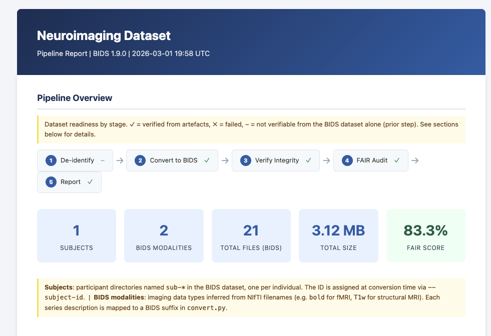

# neuro-curation

Reproducible Neuroimaging Curation & Transfer Pipeline — a modular toolkit for converting DICOM exports to BIDS format, verifying data integrity for external transfers, auditing FAIR compliance, and generating summary reports.

Built as a code sample for the UCL Dementia Research Centre Research Data Steward role (Insight 46 study).

## Where this fits

Raw DICOM exports from a scanner or imaging archive need several steps before they are ready for analysis or external sharing. This pipeline covers those steps:

```
Scanner ──> Imaging archive ──> Export DICOMs
                                      │
                        neuro-curation pipeline:
                                      │
                    [deidentify] ──> [convert] ──> BIDS Dataset
                                         │
                                         ├── [verify]  ── SHA-256 manifest
                                         ├── [audit]   ── FAIR compliance score
                                         ├── [metrics] ── KPI dashboard / DMP JSON
                                         └── [report]  ── HTML summary
                                                │
                                    Ready for DPUK / GAAIN / analysis
```

## Quick Start

```bash
# Create and activate virtual environment
uv venv .venv
source .venv/bin/activate

# Install in development mode
make install

# Run tests (no external tools required)
make test

# Download sample DICOM data for demo (requires internet)
make download

# Run the full pipeline
PYTHONPATH=src .venv/bin/python -m neuro_curation.cli run \
    --input sample_data/raw --output output --subject-id sub-01
```

## Modules

### 1. De-identification (`deidentify.py`)

Removes PII from DICOM files — direct identifiers (name, DOB, address), quasi-identifiers (age, weight), hospital system links, and vendor-specific private tags — following the DICOM PS3.15 Annex E profile. UIDs are replaced consistently across a study.

`check_xnat_deidentification(path)` reads the `PatientIdentityRemoved` DICOM tag and returns a processing recommendation: `"skip"`, `"verify_only"`, or `"full_deidentify"` — so the pipeline applies the minimum necessary processing rather than blindly re-anonymizing clean files.

### 2. DICOM to BIDS Conversion (`convert.py`)

Converts DICOM exports to NIfTI using dcm2niix and organizes the output into a BIDS-compliant directory structure. Maps scanner SeriesDescription values to BIDS suffixes (T1_MPRAGE → T1w, FLAIR_3D → FLAIR). Generates required root-level BIDS metadata: `dataset_description.json`, `participants.tsv`, `README`.

### 3. Integrity Verification (`verify.py`)

Generates SHA-256 checksums for every file in the dataset and saves them in a `transfer_manifest.json`. Essential for transfers to DPUK, GAAIN, or collaborator workstations — the manifest lets the receiving end verify that every file arrived intact. Uses chunked reads for memory efficiency with large NIfTI files.

### 4. FAIR Compliance Audit (`audit.py`)

Checks the dataset against the FAIR data principles (Wilkinson et al., 2016):
- **Findable**: `dataset_description.json` with required fields (Name, BIDSVersion, Authors)
- **Accessible**: README with meaningful content
- **Interoperable**: BIDS naming convention, compressed NIfTI (.nii.gz), JSON sidecars
- **Reusable**: LICENSE file, `participants.tsv` with data dictionary

Produces a per-principle score and an overall compliance percentage.

### 5. Pipeline KPI Metrics (`metrics.py`)

Computes four key performance indicators for pipeline health and dataset quality. Output is a structured dict that can be printed as a text dashboard or saved as JSON for DMP reporting.

| KPI | Measurement | Target |
|-----|-------------|--------|
| BIDS Validation Rate | % NIfTI files passing compression, naming, and sidecar checks | 100% |
| Checksum Match Rate | % files matching SHA-256 hashes in transfer_manifest.json | 100% |
| FAIR Compliance Score | % FAIR checks passed (F / A / I / R) via audit.py | ≥ 80% |
| Metadata Completeness | % NIfTI sessions with complete JSON sidecars | 100% |

The BIDS Validation Rate is a **gating metric**: no session should enter fMRIPrep, FreeSurfer, or any BIDS app until it passes.

### 6. HTML Summary Report (`report.py`)

Generates a self-contained HTML report showing the full pipeline output. Uses inline CSS and Jinja2 templating — a single .html file with no external dependencies, suitable for emailing with any data transfer.

Sections:
- **Pipeline Overview**: stage-by-stage status (De-identify → Convert → Verify → Audit → Report) with ✓/✗/– badges.
- **Summary cards**: subjects, BIDS modalities, total files, total size, and FAIR score at a glance.
- **Source Data**: input directory, subject ID, raw DICOM count, scanner make/model/field strength, series descriptions, and protocol parameters (TR, TE, flip angle, software version) — with ⚠ flagging when a parameter varies across series. Extracted automatically from the BIDS JSON sidecars.
- **De-identification summary**: DICOM files processed and PII tags removed.
- **Dataset completeness matrix**: subjects × modalities. Files that could not be mapped to a BIDS suffix are flagged as `unknown ⚠` with an actionable note.
- **Integrity verification**: SHA-256 pass/fail badge with re-verify command.
- **FAIR compliance**: per-principle breakdown (F/A/I/R) with an actionable fix hint below each failing check.
- **File listing** (collapsible): all files with sizes.



[View sample report (PDF)](docs/report.pdf)

### CLI (`cli.py`)

```
neuro-curation deidentify  --input DIR --output DIR --subject-id ID
neuro-curation convert     --input DIR --output DIR --subject-id ID [--session-id ID]
neuro-curation verify      --dataset DIR [--check]
neuro-curation audit       --dataset DIR
neuro-curation metrics     --dataset DIR [--output FILE]
neuro-curation report      --dataset DIR --output FILE
neuro-curation run         --input DIR --output DIR --subject-id ID
```

The `run` command chains all stages: deidentify → convert → verify → audit → metrics → report.

## Testing

```bash
make test     # 16 unit tests, all run offline with synthetic data
make lint     # ruff check + format check
```

Tests use **inline synthetic DICOM files** (created in `tests/conftest.py`) with deliberately planted PII tags. No external data, no internet, no dcm2niix required for unit tests. One integration test (full DICOM → BIDS conversion) requires dcm2niix.

The `check_xnat_deidentification()` function is tested with synthetic DICOM files simulating three scenarios: confirmed clean output, confirmed but with residual quasi-identifiers, and files with no de-identification markers at all.

## Dependencies

| Package | Purpose |
|---------|---------|
| `pydicom` | Read, modify, and write DICOM files |
| `nibabel` | Read/create NIfTI images |
| `jinja2` | HTML report templating |
| `bids-validator` | Validate BIDS filename conventions |
| `dcm2niix` | DICOM → NIfTI conversion (external binary, `brew install dcm2niix`) |

## Sample Data

The demo uses public DICOM test data from [dcm_qa_nih](https://github.com/neurolabusc/dcm_qa_nih) (Chris Rorden / dcm2niix), covering GE, Philips, and Siemens scanner series. The raw files are gitignored — run `make download` to fetch them locally.

This mirrors real-world practice where raw imaging data lives on dedicated servers rather than in code repositories.

## Design Rationale

This pipeline addresses the main gaps in an XNAT-based neuroimaging workflow: XNAT has no native BIDS export, and external transfers to networks like DPUK and GAAIN require integrity verification and FAIR compliance checks that XNAT doesn't provide. Every module is independently usable and tested with zero external setup.
